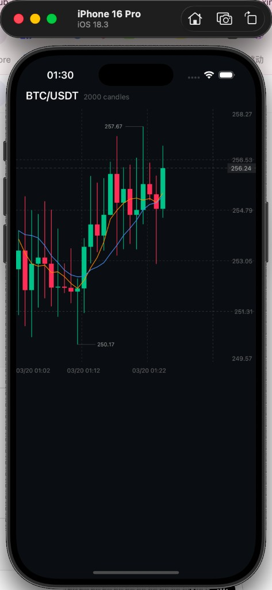
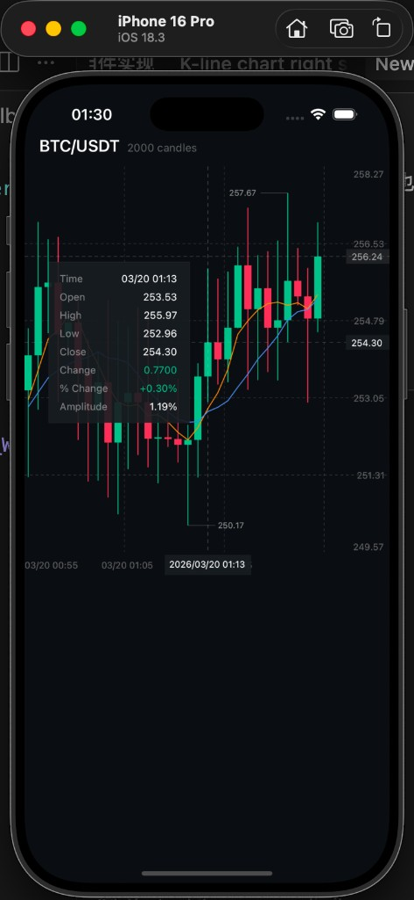

# react-native-kline-chart

[中文文档](./README.zh-CN.md)

High-performance K-line (Candlestick) chart for React Native, powered by [@shopify/react-native-skia](https://github.com/Shopify/react-native-skia).

All rendering runs on the UI thread via Skia's `PictureRecorder` — zero React component overhead per candle, smooth 60 fps gestures even with 10,000+ data points.

## Screenshots

<p align="center">
  
  &nbsp;&nbsp;
  
</p>

## Features

- **Skia Canvas rendering** — Immediate-mode drawing via `PictureRecorder`, no React reconciliation per candle
- **UI-thread gestures** — Pan, pinch-zoom, long-press crosshair, all running as Reanimated worklets
- **Viewport clipping** — Only visible candles are drawn; handles 10,000+ data points without jank
- **MA indicators** — Built-in moving average lines with configurable periods and colors (default MA5 / MA10)
- **Crosshair + Info panel** — Long-press to show crosshair with OHLC, change, % change, and amplitude
- **Last price line** — Dashed horizontal line showing the latest close price
- **High / Low markers** — Visible high and low prices annotated directly on the chart
- **Price formatting** — Thousand separators, adaptive decimal places
- **X / Y axis labels** — Time labels on X-axis, price labels on Y-axis
- **Dashed grid** — Configurable grid rows and column intervals
- **Right padding** — Extra space after the last candle for readability
- **Fully customizable** — Colors, sizes, spacing, indicator periods, and more

## Installation

```bash
npm install react-native-kline-chart
# or
yarn add react-native-kline-chart
```

### Peer dependencies

Make sure these are installed in your app:

```bash
npm install @shopify/react-native-skia react-native-reanimated react-native-gesture-handler
```

Add the Reanimated Babel plugin to your `babel.config.js`:

```js
module.exports = {
  plugins: ['react-native-reanimated/plugin'],
};
```

## Quick Start

```tsx
import { KlineChart } from 'react-native-kline-chart';
import { GestureHandlerRootView } from 'react-native-gesture-handler';

function App() {
  const data = [
    { time: 1700000000000, open: 100, high: 105, low: 98, close: 103 },
    { time: 1700000060000, open: 103, high: 107, low: 101, close: 99 },
    // ...more candles
  ];

  return (
    <GestureHandlerRootView style={{ flex: 1 }}>
      <KlineChart
        data={data}
        width={400}
        height={600}
      />
    </GestureHandlerRootView>
  );
}
```

## API

### `<KlineChart />`

| Prop | Type | Default | Description |
|------|------|---------|-------------|
| `data` | `Candle[]` | **required** | Array of candle data |
| `width` | `number` | **required** | Canvas width in pixels |
| `height` | `number` | **required** | Canvas height in pixels |
| `candleWidth` | `number` | `8` | Width of each candle body |
| `candleSpacing` | `number` | `3` | Gap between candles |
| `minCandleWidth` | `number` | `2` | Minimum candle width when pinch-zooming out |
| `maxCandleWidth` | `number` | `24` | Maximum candle width when pinch-zooming in |
| `bullishColor` | `string` | `'#2DC08E'` | Color for bullish (close >= open) candles |
| `bearishColor` | `string` | `'#F6465D'` | Color for bearish candles |
| `showMA` | `boolean` | `true` | Show moving average lines |
| `maPeriods` | `number[]` | `[5, 10]` | MA calculation periods |
| `maColors` | `string[]` | `['#F7931A', '#5B8DEF', '#C084FC']` | Colors for each MA line |
| `showCrosshair` | `boolean` | `true` | Enable long-press crosshair with info panel |
| `backgroundColor` | `string` | `'#0B0E11'` | Chart background color |
| `gridColor` | `string` | `'rgba(255,255,255,0.2)'` | Grid line color |
| `textColor` | `string` | `'rgba(255,255,255,0.35)'` | Axis label color |
| `crosshairColor` | `string` | `'rgba(255,255,255,0.3)'` | Crosshair line color |
| `rightPaddingCandles` | `number` | `20` | Number of empty candle widths as right padding |
| `onCrosshairChange` | `(candle: Candle \| null) => void` | — | Callback when crosshair activates/deactivates |

### `Candle` type

```typescript
type Candle = {
  time: number;   // timestamp in milliseconds
  open: number;
  high: number;
  low: number;
  close: number;
};
```

### Exports

```typescript
import { KlineChart, computeMA } from 'react-native-kline-chart';
import type { Candle, KlineChartProps } from 'react-native-kline-chart';
```

## Architecture

### Rendering: Immediate Mode (Picture API)

Uses `Skia.PictureRecorder` inside a `useDerivedValue` worklet to batch all drawing commands on the UI thread. This avoids creating React components per candle and eliminates reconciliation overhead during gestures.

### Gestures

- **Pan** — Scroll through historical data by updating `scrollOffset` shared value
- **Pinch** — Zoom in/out by changing `candleWidth` shared value
- **Long-press** — Activate crosshair with info panel overlay

All gesture callbacks run as Reanimated worklets on the UI thread.

### Performance

- Only visible candles are drawn (viewport clipping)
- MA values are pre-computed with `useMemo` on the JS thread
- All animation/gesture state uses Reanimated `SharedValue` (no React re-renders)
- Paint objects are reused for all bullish/bearish candles
- Thousand-separator formatting runs inside worklets

## Running the Example

```bash
cd example
npm install
cd ios && pod install && cd ..
npx react-native run-ios
```

## License

MIT
